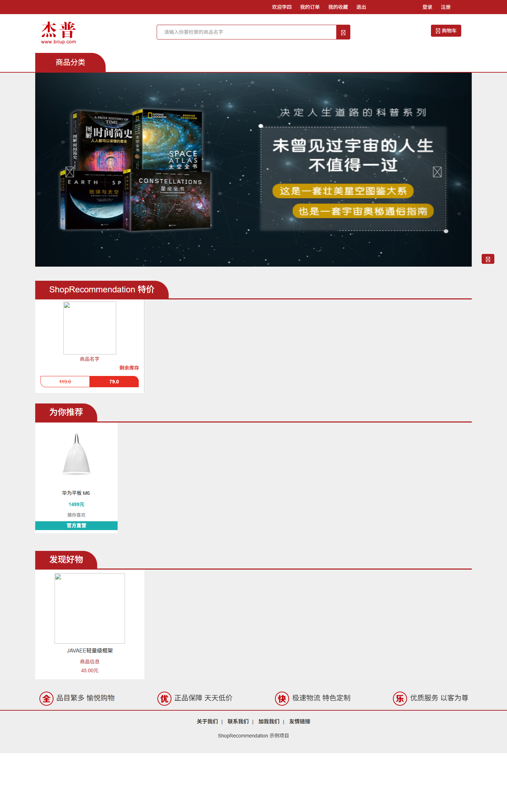
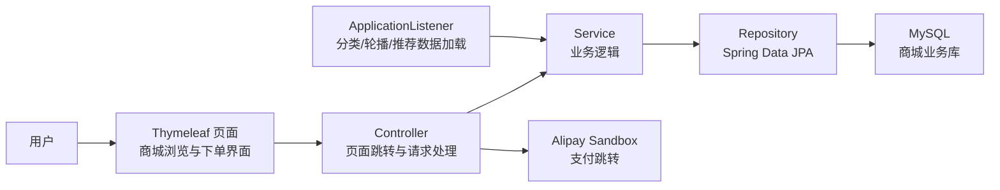
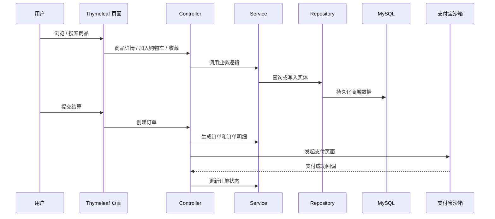

<h1 align="center">ShopRecommendation</h1>

<p align="center">Java Web 电商推荐系统，覆盖商品浏览、分类检索、收藏、购物车、订单结算、支付沙箱和推荐商品展示。</p>

<p align="center">
  <a href="./README.md">简体中文</a> | <a href="./README.en.md">English</a>
</p>

<p align="center">
  
  
  
  <a href="./LICENSE"></a>
</p>

<p align="center">
  
</p>

电商推荐系统，Java Web 课程阶段项目。项目以在线商城业务场景为背景，围绕用户、商品、分类、收藏、购物车、收货地址、订单结算和推荐商品展示，构建了一个基于 Spring Boot + Thymeleaf + JPA 的完整商城业务流程。

当前仓库已经整理为可公开展示版本，包含 Spring Boot 后端、Thymeleaf 页面模板、静态页面资源、JPA 实体与业务分层代码，并对本地数据库地址、数据库密码和支付宝沙箱密钥进行了环境变量化处理。

> 说明：本仓库不包含历史本地数据库数据，也不包含真实或沙箱支付密钥。项目主要用于展示 Java Web 分层设计、商城业务建模、页面交互流程和公开仓库整理方式。若要完整运行演示，需要自行准备 MySQL 数据库和少量商品、分类、用户等测试数据。

## 项目功能

- 用户注册、登录和退出登录
- 首页商品展示、商品分类与商品搜索
- 商品详情、价格、库存、销量和浏览量展示
- 商品收藏、收藏列表和收藏状态判断
- 购物车添加、删除、数量调整和结算
- 收货地址新增、默认地址排序和订单确认
- 订单创建、订单列表、支付成功回调与订单状态更新
- 支付宝沙箱支付参数接入
- 基于 `RecommendShop` 的推荐商品数据模型与首页推荐展示
- Web 登录过滤器和应用启动数据加载监听器

## 技术栈

| 模块 | 技术 |
| --- | --- |
| 后端 | Spring Boot 2.5.0、Spring MVC、Spring Data JPA、Lombok |
| 页面 | Thymeleaf、HTML、CSS、Bootstrap、jQuery |
| 数据库 | MySQL、Hibernate/JPA |
| 支付 | Alipay SDK、支付宝沙箱 |
| 接口文档 | Springfox Swagger 2 |
| 构建工具 | Maven Wrapper |
| 测试 | JUnit 5、Spring Boot Test |

## 系统架构



项目整体是一个 Spring Boot 单体 Web 应用。页面由 Thymeleaf 渲染，业务逻辑通过 Controller、Service、Repository 分层组织，数据持久化使用 Spring Data JPA，支付流程通过支付宝沙箱 SDK 发起页面支付。

## 目录结构

```text
ShopRecommendation/
├── .mvn/                       # Maven Wrapper 配置
├── src/main/java/              # Java 业务代码
│   └── com/briup/shop/
│       ├── bean/               # JPA 实体与 VO
│       ├── conf/               # Web 与支付配置
│       ├── dao/                # Spring Data JPA Repository
│       ├── service/            # 业务接口与实现
│       └── web/                # Controller、Filter、Listener
├── src/main/resources/
│   ├── static/                 # CSS、JS、图片、字体等静态资源
│   ├── templates/              # Thymeleaf 页面模板
│   ├── application.yml         # 应用配置，敏感项使用环境变量
│   └── logback-spring.xml      # 日志配置
├── src/test/java/              # 测试代码
├── .env.example                # 环境变量示例
├── .gitignore
├── mvnw
├── mvnw.cmd
├── pom.xml
└── README.md
```

## 核心业务链路

用户进入首页后，系统从应用上下文中读取分类、轮播图和推荐商品数据。用户可以浏览商品、搜索商品、进入详情页，并将商品加入收藏或购物车。结算时，系统读取购物车商品和用户收货地址，创建订单和订单明细，再进入支付宝沙箱支付流程。支付成功后，订单状态更新，并记录用户与商品之间的行为日志。



## 数据库与配置说明

当前仓库不包含历史本地数据库，原因包括：

- 历史开发环境中的 MySQL 地址、账号和密码不适合公开。
- 商品、分类、用户、订单等演示数据需要根据新的本地环境重新构造。
- 支付宝沙箱 AppId、公钥和私钥属于敏感配置，不能提交到公开仓库。

公开版本已经将这些配置改为环境变量：

| 变量 | 说明 |
| --- | --- |
| `SHOP_DB_URL` | MySQL 连接地址 |
| `SHOP_DB_USERNAME` | MySQL 用户名 |
| `SHOP_DB_PASSWORD` | MySQL 密码 |
| `SHOP_JPA_DDL_AUTO` | JPA schema 策略，默认 `update` |
| `SHOP_JPA_SHOW_SQL` | 是否输出 SQL，默认 `true` |
| `SHOP_ASSET_BASE_URL` | 商品图片等静态资源基础地址 |
| `SHOP_LOG_PATH` | 日志输出目录，默认 `logs`，相对于启动目录 |
| `SERVER_PORT` | 服务端口，默认 `9800` |
| `ALIPAY_APP_ID` | 支付宝沙箱应用 ID |
| `ALIPAY_APP_PRIVATE_KEY` | 支付宝沙箱应用私钥 |
| `ALIPAY_PUBLIC_KEY` | 支付宝沙箱公钥 |

完整示例见 [.env.example](./.env.example)。

## 部署说明

### 1. 准备数据库

```sql
CREATE DATABASE shop_recommendation DEFAULT CHARACTER SET utf8mb4 COLLATE utf8mb4_unicode_ci;
```

项目当前依赖 JPA `ddl-auto=update` 自动维护表结构。首次运行前，需要准备 MySQL 服务；首次启动后，可根据实体表结构补充商品、分类、轮播图、推荐商品和用户等演示数据。

### 2. 配置环境变量

PowerShell 示例：

```powershell
$env:SHOP_DB_URL="jdbc:mysql://localhost:3306/shop_recommendation?useUnicode=true&characterEncoding=utf8&serverTimezone=Asia/Shanghai&useSSL=false&allowPublicKeyRetrieval=true"
$env:SHOP_DB_USERNAME="root"
$env:SHOP_DB_PASSWORD="your_password"
$env:SERVER_PORT="9800"
```

如需测试支付流程，还需要配置支付宝沙箱变量：

```powershell
$env:ALIPAY_APP_ID="your_app_id"
$env:ALIPAY_APP_PRIVATE_KEY="your_private_key"
$env:ALIPAY_PUBLIC_KEY="your_alipay_public_key"
```

### 3. 启动项目

```powershell
.\mvnw.cmd spring-boot:run
```

默认访问地址：

```text
http://localhost:9800/
```

### 4. 运行测试

```powershell
.\mvnw.cmd test
```

## 项目亮点

- 覆盖电商项目中常见的用户、商品、收藏、购物车、地址、订单和支付业务。
- 使用 Spring Boot + Thymeleaf 构建服务端渲染商城页面，适合展示传统 Java Web 项目能力。
- 使用 Spring Data JPA 建模实体关系，包括商品分类、订单明细、购物车、收藏和推荐商品。
- 通过 `ApplicationListener` 在应用启动时加载分类、轮播图和推荐商品，支持首页展示。
- 接入支付宝沙箱支付流程，演示订单创建到支付成功回调的完整链路。
- 已清理本地构建产物、IDE 配置、运行日志和系统文件，适合整理后上传 GitHub。
- 已移除历史本地数据库地址、数据库密码和支付宝密钥，公开仓库中只保留环境变量示例。

## 后续可改进方向

- 补充脱敏后的 MySQL 建表 SQL 和少量演示数据。
- 增加页面截图，展示首页、商品详情、购物车、订单确认和支付流程。
- 将登录认证升级为更完整的安全方案，例如 Spring Security。
- 为核心 Service 和 Controller 增加更完整的单元测试或集成测试。
- 优化历史页面资源和部分编码异常注释，提升代码可读性。
- 将推荐商品从静态推荐表扩展为基于用户行为的推荐计算。
